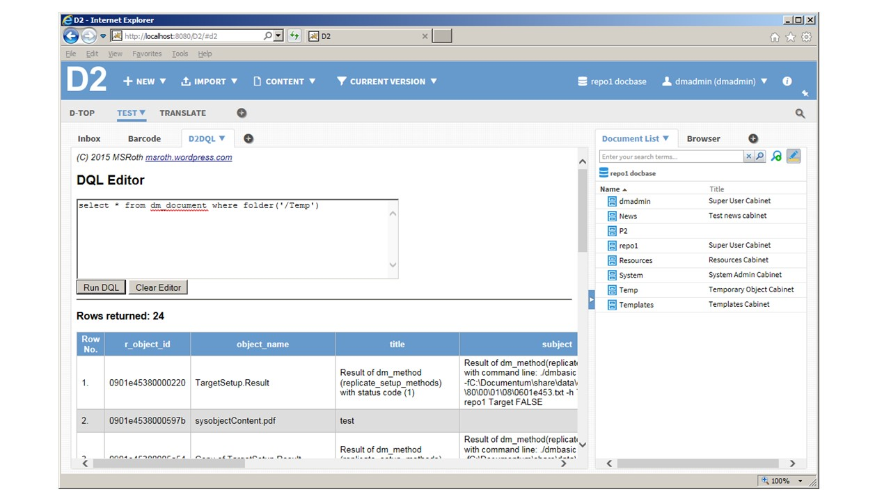

# D2DQL
Simple DQL editor for the Documentum D2 platform (external widget)

One function of Webtop that I really miss in D2 is the DQL Editor.  So, as an exercise to learn how to create external D2 widgets that use bi-directional communication, I decided to build one.  The D2 DQL Editor looks and functions similarly to the DQL Editor in Webtop (see figure).  For details regarding how this external widget was created, see my blog post here: https://msroth.wordpress.com/2015/10/07/d2-v4-5-dql-editor-widget-part-1/

